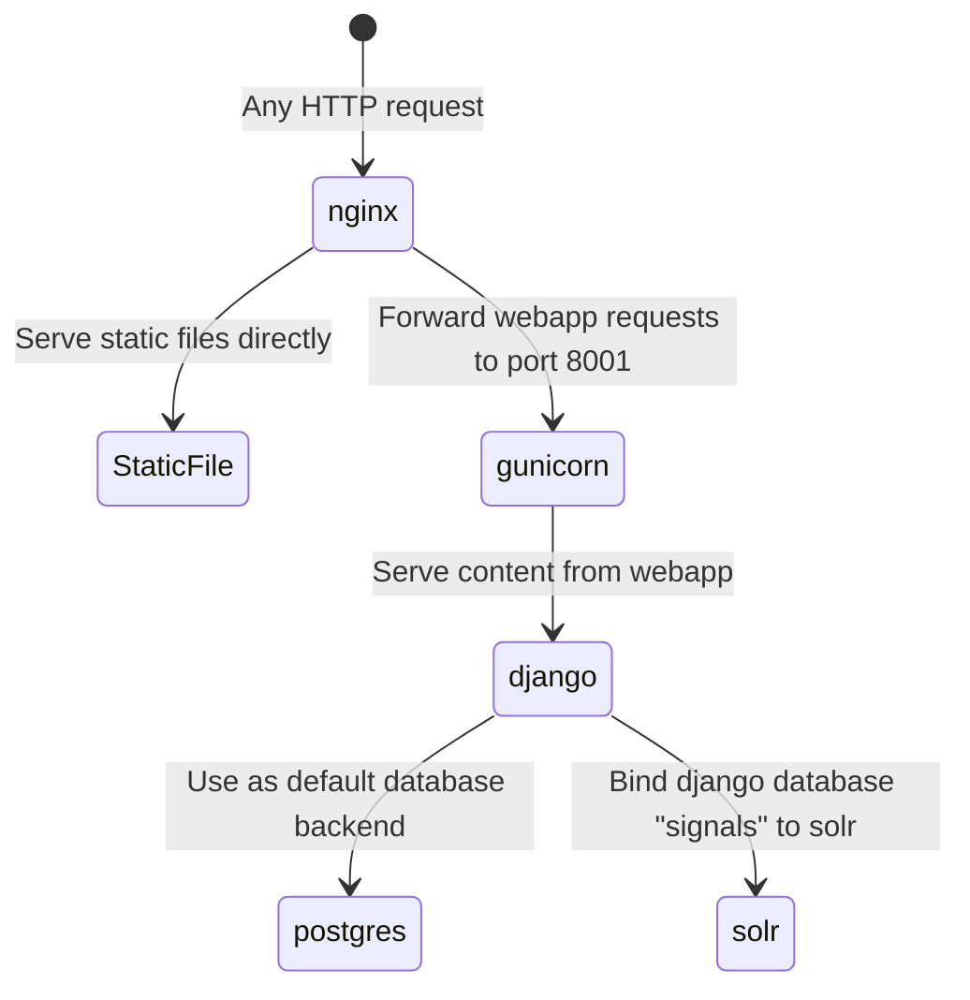

# [Cantus Ultimus](http://cantus.simssa.ca/)

[](https://travis-ci.org/DDMAL/cantus) [](https://coveralls.io/github/DDMAL/cantus?branch=develop)

Serving images on a website using [Apache Solr](http://lucene.apache.org/solr/), [Diva.js](https://ddmal.github.io/diva.js/) and the [CANTUS](http://cantusdatabase.org/) collection.

## Cloning the repository

The repository of the Cantus Ultimus website has a submodule `cantus-staticpages` with the static pages of the website.

Therefore, when cloning the repository, please add the `--recursive` flag:

```
git clone https://github.com/DDMAL/cantus.git --recursive
```

An alternative option is to clone the repository as you normally would, and then get the submodule:

```
git submodule update --init
```

## Launching the website
We use [Docker Compose](https://docs.docker.com/compose/) to containerize each service and keep all our dependencies in order.

### The `.env` file
The build process relies on environment variables specified in the `.env` file, which is located at the root of the repository. 

The most important variable here is `POSTGRES_PASSWORD`, which must be set by uncommenting it from the code, and setting it with a secure password.

#### Handling `postgres` authentication issues

When the containers are launched, a volume, `data/postgres`, will be created. When the `POSTGRES_PASSWORD` is changed between builds of the docker containers, the `postgres` container might run into an authentication problem because of the existing volume. If you run into that problem, make sure to remove the volume and re-launch the containers

```
docker rm -v <container-id>
rm -r data
```

### Launch in development

In the `.env` file, the `PORT` variable is set to `8000` (development) by default. This will turn on Django's debug mode, showing detailed traces when Django encounters errors, as well as turn off security settings that might stop you from accessing the site locally. In production, this should be set to `80`.

> **Windows Users:** Make sure `/app/django-config.sh` has `LF` line endings before launching. This file gets copied over into an Ubuntu container and will break the process if git automatically checked out the file using Windows (`CRLF`) line endings.

Execute the following commands from the root directory of the repo:

```sh
# Build the images and launch the containers (this will take a while)
$ docker-compose up -d
```

When testing your changes, include the `--build` flag to see your changes propagate into the containers:

```
docker-compose up --build -d
```

After the building process completes (10 to 30 minutes), the site should be available on http://localhost:8000/ in your host machine.

By default, Cantus Ultimus works in the following way:



#### Enabling live changes with django's `runserver`

During development, it is often useful to replace `gunicorn` with the default `django` web server, so that modifying the source code results in live changes in the website. This is done by default in `django-config.sh`. If you need to test `gunicorn` during development, edit the if statement in this file.

### Launch in production

From the Compute Canada VM, follow the same instructions as above, only replace `docker-compose` with `docker compose` and make sure to keep `PORT=80` in the `.env` file.

## Initialize a newly launched website

A freshly initialized instance of the website does not have an admin account. Addititionally, the databases of Manuscripts, Chants, and Folios are not populated.

A few commands will create an admin account and populate the database.

Assuming that the site has been launched and is accessible in http://localhost:8000/, fire up another terminal.

The first thing we need to do is to create an admin account for the website.

```sh
# Creating a django admin account for the website
$ docker-compose exec app python manage.py createsuperuser

Username (leave blank to use 'root'): 
Email address: 
Password: 
Password (again): 
Superuser created successfully.
```

Using your admin credentials, verify that you are able to log into the admin django site, which should be located in http://localhost:8000/admin/


When navigating through any of the tables in the admin interface (e.g., Manuscripts, Concordances, and Chants), they will appear to be empty.

We can pre-populate the Concordances, Manuscripts, and Chants from the information available in the [Cantus Database](http://cantus.uwaterloo.ca/).

The scripts to populate the database are included in the repository. Head back to the terminal where you created the admin user account.

Import the concordances, manuscripts, and chants

```sh
# Import the concordances
$ docker-compose exec app python manage.py import_data concordances
Deleting old concordances data...
Successfully imported 12 concordances into database.
Waiting for Solr to finish...
Done.

# Import the manuscripts
$ docker-compose exec app python manage.py import_data manuscripts
Deleting old manuscripts data...
Starting manuscript import process.
# It should take about 5 minutes to import the data.
Successfully imported 155 manuscripts into database.
Waiting for Solr to finish...
Done.

# Import the IIIF manifest urls
$ docker-compose exec app python manage.py import_data iiif
Deleting old iiif data...
Waiting for Solr to finish...
Done.
```

An additional command is included to import chants associated with a specific manuscript

```sh
$ docker-compose exec app python manage.py import_data chants --manuscript-id MANUSCRIPT_ID
```
however, this process can already be done using the user interface. We recommend using the user interface from this point onward.

## Adding manuscripts and chants using the admin user interface

Once the manuscript information has been fetched from the Cantus Database,
additionally to the Manuscript's metadata, the following fields become available:


(Paris, F-Pnm lat. 15181)

- The cantus URL
- The cantus CSV export URL, which contains all chant/folio associations for this manuscript

The process for turning any Manuscript in the initialized database into a searchable Manuscript
in the Cantus Ultimus interface involves the following steps:

1. Importing all the chant information of the manuscript
2. Defining the source images of the Manuscript through a IIIF Manifest file
3. Setting the Manuscript as a `public` Manuscript in the Cantus Ultimus interface
4. Map the folio information from Cantus Database to the images obtained from the IIIF Manifest

### Importing chant information

In the admin interface (located in http://localhost:8000/admin), navigate the list of Manuscripts and select the one you wish to enable in Cantus Ultimus.

Select the manuscript by ticking its corresponding check box.

In the `Actions` menu located at the top, trigger the action called `Import the chants associated with the selected manuscript(s)`.


This will trigger a series of queries in the backend. Wait until you see the notification `Loaded chants for manuscript` above the `Actions` menu. It may take a few minutes for this process to complete.

After refreshing the admin page and looking at the Manuscript in the list, it should appear with the flag `Chants loaded` enabled. This indicates that the chant information has been added to the database and solr index. 


### Defining the source images of the Manuscript through a IIIF Manifest file

Of all the manuscripts in the list displayed in the admin interface, only a handful have a public IIIF Manifest with source images.

IIIF Manifest files can be found within libraries such as [Gallica](https://gallica.bnf.fr/accueil/en/content/accueil-en?mode=desktop), [e-codices](https://www.e-codices.unifr.ch/en), and others.

A list of known manifests is maintained in `app/data_dumps/manifests.csv` and is automatically applied to the database by running `import_data iiif`. When a IIIF Manifest is located for a specific manuscript, the URL can be included in the manuscript's metadata manually:

Click on the Manuscript's entry.

Introduce the IIIF Manifest URL under the `Manifest url` field.


Save the changes.

### Setting the Manuscript as a `public` Manuscript in the Cantus Ultimus interface

Making a manuscript a `public` manuscript indicates to the Cantus Ultimus website that the manuscript should show up under the `Manuscript` tab of the final user's web interface.

Click on the Manuscript's entry.

Tick the `public` value.


Save the changes.

### Map the folio information from Cantus Database to the images obtained from the IIIF Manifest

Once the chant information and IIIF manifest url have been added to a Manuscript, and the manuscript has been marked as `public`, the mapping tool becomes available to map the images with the folio metadata.

The mapping tool is located in the following address: http://localhost:8000/admin/map_folios

Within the mapping tool, the new manuscript should appear with an option to `Map now`.


Click on `Map now`.

The mapping tool triggers a heuristic search on the background, which tries to map the images in the IIIF Manifest to the folios described in the Cantus Database.

The result of that automatic process will be displayed in the mapping interface.

At this point, the user might want to verify that the information provided by the automatic mapping is accurate, and correct it when it is not.

In the mapping interface, green folio pages indicate a folio has been mapped to an image manifest, whereas a red folio page indicates that a folio has not been mapped to an image from the manifest.


Once the mapping process has been manually revised, conclude the mapping process by clicking on `Submit this Mapping`.

It may take several minutes for the backend of the website to deploy the changes across the database and solr index.

The user will be able to know when that process has concluded by revisiting the admin interface. A complete mapping process will activate the `Is mapped` flag in the corresponding manuscript.

At this point, the manuscript should be searchable within the main website.
