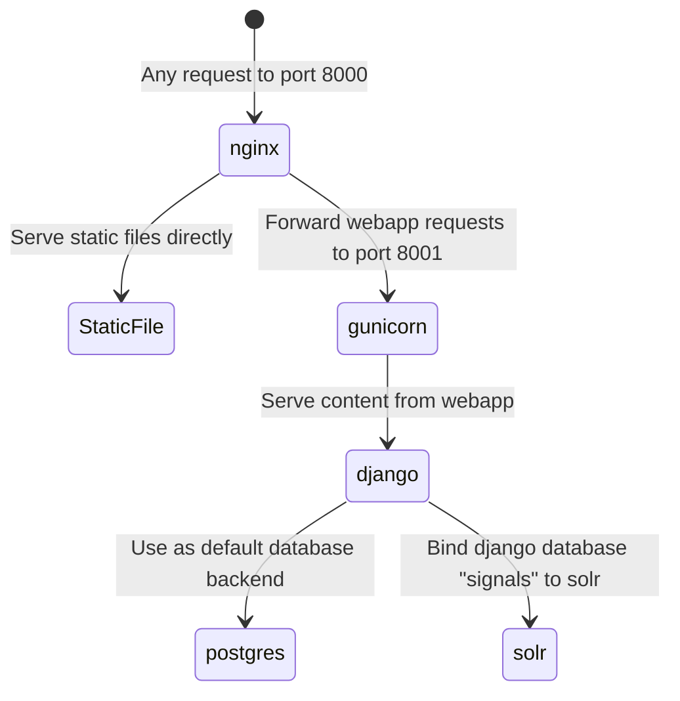

# [Cantus Ultimus](http://cantus.simssa.ca/)

Serving images on a website using [Apache Solr](http://lucene.apache.org/solr/), [Diva.js](https://ddmal.github.io/diva.js/) and the [CANTUS](https://cantusdatabase.org/) collection.

The status of manuscripts served by Cantus Ultimus is available [here](#manuscript-inventory). Inclusion of additional manuscripts should be recorded there.

## Cloning the repository

The repository of the Cantus Ultimus website has a submodule `cantus-staticpages` with the static pages of the website.

Therefore, when cloning the repository, please add the `--recursive` flag:

```
git clone https://github.com/DDMAL/cantus.git --recursive
```

An alternative option is to clone the repository as you normally would, and then get the submodule:

```
git submodule update --init
```

## Launching the website
We use [Docker Compose](https://docs.docker.com/compose/) to containerize each service and keep all our dependencies in order. Cantus Ultimus is compatible with Docker Compose > 2.8.

### The `.env` file
The build process relies on environment variables specified in an `.env` file located at the root of the repository. A sample of this file, `.env.sample`, is provided.

Make a copy of `.env.sample` and name it `.env`. You must make two modifications to this file before the docker containers will build.  Both `POSTGRES_PASSWORD` and `RABBIT_PASSWORD` should be uncommented and set with secure passwords.

Before launching the site, ensure that the `DEVELOPMENT` variable is set correctly. For development, it should be set to `True`; for deployment, it should be `False`. This variable configures the application's debug settings. Deploying the website with `DEVELOPMENT=True` would leak debugging information on a live server and use Django's development server rather than gunicorn and must be avoided.

#### Handling `postgres` authentication issues

When the containers are launched, a directory at `./data/postgres`, will be created and mounted to the `postgres` container. When the `POSTGRES_PASSWORD` is changed between builds of the docker containers, the `postgres` container might run into an authentication problem because of the existing volume. If you run into that problem, make sure to remove the volume and re-launch the containers

```
docker rm -v <container-id>
rm -r data
```

### Launch in development

In the `.env.sample` file, the `DEVELOPMENT` variable is set to `False` by default. For local development, set this to `True` to turn on Django's debug mode, which allows you to access detailed traces when Django encounters errors. For deployment on a server, this should remain set to `False`.

> **Windows Users:** Make sure `/app/django-config.sh` has `LF` line endings before launching. This file gets copied over into an Ubuntu container and will break the process if git automatically checked out the file using Windows (`CRLF`) line endings.

Execute the following commands from the root directory of the repo:

```sh
# Build the images and launch the containers (this will take a while)
$ docker compose build
$ docker compose up -d  
```

When testing subsequent changes, you can do this in one step by including the `--build` flag:

```
docker compose up --build -d
```

After the build process completes, the site should be available on http://localhost:8000/ in your host machine.

By default, Cantus Ultimus works in the following way:




Python dependencies are managed with the `poetry` package. Although you don't necessarily need to create a local environment with these dependencies (they are installed inside the `app` container during the build process), it may nevertheless be useful (for example, for type checking). To do so, install [`poetry`](https://python-poetry.org/) on your development machine and use it to install the project's dependencies into a virtual environment.

Cantus Ultimus has a few python dependencies that are for development only (for example, the code formatter `black`). These are located in the `dev` group (see the `pyproject.toml` file). To install these for local development, use command: `poetry install --with dev`.

#### Enabling live changes with django's `runserver`


### Database migrations

Whenever changes are made to database models, they need to be applied to the PostgreSQL database. This occurs through Django's migrations.

If, during development, you make a change to any models, build and run the containers, as above. Then, enter the command line in the `app` container:

```sh
$ docker compose exec -it app bash
```

Then, run the `makemigrations` command:

```sh
$ python manage.py makemigrations
```

Migrations will then be created in the `./app/public/cantusdata/migrations/` folder. Commit these migrations and include in the pull request that includes the model changes. 

You will also need to apply these migrations to the database to your development database and, once these model changes are deployed to servers, to staging, production, and any other remote databases. To apply the changes, enter the command line in the `app` container as before and run the `migrate` command:

```sh
$ python manage.py migrate
```

Note that migrations will also need to be applied to a newly instantiated database using the `migrate` command.

### Launch in production

From the Compute Canada VM, follow the same instructions as above, making sure `DEVELOPMENT=False` is in the `.env` file.

## Initialize a newly launched website (for development or deployment)

A freshly initialized instance of the website does not have an admin account or any data in the database.

A few commands will create an admin account and populate the database.

Assuming that the site has been launched and is accessible in http://localhost:8000/, fire up another terminal.

The first thing we need to do is to create an admin account for the website.

```sh
# Creating a django admin account for the website
$ docker-compose exec app python manage.py createsuperuser

Username (leave blank to use 'root'): 
Email address: 
Password: 
Password (again): 
Superuser created successfully.
```

Using your admin credentials, verify that you are able to log into the admin django site, which should be located at `/admin/`. 


When initializing the site, remember to apply migrations to the database (see the "Database Migrations" section above).

When navigating through any of the tables in the admin interface (e.g., Manuscripts,  and Chants), they will appear to be empty.

We can populate the Manuscripts and Chants from the information available in the [Cantus Database](https://cantusdatabase.org/).

The scripts to populate the database are included in the repository. Head back to the terminal where you created the admin user account.

Import the manuscripts and chants

```sh
# Import the manuscripts
$ docker-compose exec app python manage.py import_data manuscripts
Deleting old manuscripts data...
Starting manuscript import process.
# It should take about 5 minutes to import the data.
Successfully imported 155 manuscripts into database.
Waiting for Solr to finish...
Done.

# Import the IIIF manifest urls
$ docker-compose exec app python manage.py import_data iiif
Deleting old iiif data...
Waiting for Solr to finish...
Done.
```

An additional command is included to import chants associated with a specific manuscript

```sh
$ docker-compose exec app python manage.py import_data chants --manuscript-id MANUSCRIPT_ID
```

This process can also be done using the user interface (recommended; see below).

## Adding manuscripts and chants using the admin user interface

Once the manuscript information has been fetched from the Cantus Database,
additionally to the Manuscript's metadata, the following fields become available:


(Paris, F-Pnm lat. 15181)

- The cantus URL
- The cantus CSV export URL, which contains all chant/folio associations for this manuscript

The process for turning any Manuscript in the initialized database into a searchable Manuscript
in the Cantus Ultimus interface involves the following steps:

1. Importing all the chant information of the manuscript
2. Defining the source images of the Manuscript through a IIIF Manifest file
3. Setting the Manuscript as a `public` Manuscript in the Cantus Ultimus interface
4. Map the folio information from Cantus Database to the images obtained from the IIIF Manifest

### Importing chant information

In the admin interface (located in http://localhost:8000/admin), navigate the list of Manuscripts and select the one you wish to enable in Cantus Ultimus.

Select the manuscript by ticking its corresponding check box.

In the `Actions` menu located at the top, trigger the action called `Import the chants associated with the selected manuscript(s)`.


This will trigger a series of queries in the backend. Wait until you see the notification `Loaded chants for manuscript` above the `Actions` menu. It may take a few minutes for this process to complete.

After refreshing the admin page and looking at the Manuscript in the list, it should appear with the flag `Chants loaded` enabled. This indicates that the chant information has been added to the database and solr index. 


### Defining the source images of the Manuscript through a IIIF Manifest file

Of all the manuscripts in the list displayed in the admin interface, only a handful have a public IIIF Manifest with source images.

IIIF Manifest files can be found within libraries such as [Gallica](https://gallica.bnf.fr/accueil/en/content/accueil-en?mode=desktop), [e-codices](https://www.e-codices.unifr.ch/en), and others.

A list of known manifests is maintained in `app/public/data_dumps/manifests.csv` and is automatically applied to the database by running `import_data iiif`. When a IIIF Manifest is located for a specific manuscript, the URL can be included in the manuscript's metadata manually:

Click on the Manuscript's entry.

Introduce the IIIF Manifest URL under the `Manifest url` field.


Save the changes.

### Setting the Manuscript as a `public` Manuscript in the Cantus Ultimus interface

Making a manuscript a `public` manuscript indicates to the Cantus Ultimus website that the manuscript should show up under the `Manuscript` tab of the final user's web interface.

Click on the Manuscript's entry.

Tick the `public` value.


Save the changes.

### Map the folio information from Cantus Database to the images obtained from the IIIF Manifest

Once the chant information and IIIF manifest url have been added to a Manuscript, and the manuscript has been marked as `public`, the mapping tool becomes available to map the images with the folio metadata.

The mapping tool is located in the following address: http://localhost:8000/admin/map_folios

Within the mapping tool, the new manuscript should appear with an option to `Map now`.


Click on `Map now`.

The mapping tool triggers a heuristic search on the background, which tries to map the images in the IIIF Manifest to the folios described in the Cantus Database.

The result of that automatic process will be displayed in the mapping interface.

At this point, the user might want to verify that the information provided by the automatic mapping is accurate, and correct it when it is not.

In the mapping interface, green folio pages indicate a folio has been mapped to an image manifest, whereas a red folio page indicates that a folio has not been mapped to an image from the manifest.


Once the mapping process has been manually revised, conclude the mapping process by clicking on `Submit this Mapping`.

It may take several minutes for the backend of the website to deploy the changes across the database and solr index.

The user will be able to know when that process has concluded by revisiting the admin interface. A complete mapping process will activate the `Is mapped` flag in the corresponding manuscript.

At this point, the manuscript should be searchable within the main website.

### Indexing MEI and activating OMR search

To add OMR search functionality to a manuscript, a set of MEI 5 files for the manuscript needs to be added to the [production MEI files repository](https://github.com/DDMAL/production_mei_files). Add these files in a folder named with the Cantus Database source ID for the manuscript. The mei files must be named by the following convention: *_[folio_number].mei. Once these are committed to the main branch of the production MEI files repo, they can be pulled with the rest of the Cantus Ultimus code base (the production MEI files repository is a submodule of the CU repo).

In the running `app` container, run the `index_manuscript_mei` command with the first command line argument being the source ID of the manuscript. Additional command line options can be found in that command's help text. Once this command has completed, the manuscript MEI has been indexed in Solr.

Go to the Cantus Ultimus admin page and ensure that the "Neume Search" and "Pitch Search" plugins exist in the database. If they do not, simply create new plugins with those names. Then, find the manuscript whose MEI you are adding in the admin panel. On that manuscript's admin page, select either the "Neume Search" plugin (if the manuscript's neumes are unpitched) or both the "Neume Search" and "Pitch Search" plugin (if the manuscript's neumes are pitched). Save the manuscript form.

When you navigate to that manuscript's detail view, OMR search should be available in the search panel.


## Manuscript Inventory

| Name                                                                                                       | Provenance         | Siglum                         | Cantus DB Record | IIIF Manifest | Supported | Served on cantus.simssa.ca | Notes                                                 |
| ---------------------------------------------------------------------------------------------------------- | ------------------ | ------------------------------ | :--------------: | :-----------: | :--------:| :------------------------: | ----------------------------------------------------- |
| Arras, Bibliothèque municipale, 893 (olim 465)                                                             | Arras              | F-AS 893                       | Y                | Y             | Y         |                            |                                                       |
| Città del Vaticano (Roma), Biblioteca Apostolica Vaticana, lat. 8737                                       | Italy              | I-Rvat lat. 8737               | Y                | Y             |           |                            | Urlopen error on loading manifest                     |
| Città del Vaticano (Roma), Biblioteca Apostolica Vaticana, San Pietro B.79                                 | Rome               | I-Rvat SP B.79                 | Y                | Y             |           |                            | Urlopen error on loading manifest                     |
| Dendermonde, Sint-Pieters-en Paulusabdij, ms. 9                                                            | Rupertsberg        | B-Dea 9                        | Y                | Y             | Y         | Y                          |                                                       |
| Einsiedeln, Kloster Einsiedeln - Musikbibliothek, 611                                                      | Einsiedeln         | CH-E 611                       | Y                | Y             | Y         | Y                          |                                                       |
| Einsiedeln, Stiftsbibliothek, Codex 121                                                                    | Einsiedeln         | CH-E 121                       | Y                | Y             | Y         |                            |                                                       |
| Fribourg, Bibliothèque des Cordeliers, 2                                                                   | Franciscan         | CH-Fco 2                       | Y                | Y             | Y         | Y                          |                                                       |
| Fulda, Hessische Landesbibliothek, Aa 55                                                                   | Rasdorf            | D-Ful Aa 55                    | Y                | Y             |           |                            | Solved with #575. To be tested.                       |
| Gent, Universiteitsbibliotheek, Hs BKT.006 ("Tsgrooten Antiphoner")                                        | Tongerloo          | B-Gu Hs BKT.006                | Y                | Y             |           |                            |                                                       |
| Gottschalk Antiphoner (fragments)                                                                          | Lambach Abbey      | GOTTSCHALK                     | Y                | Y             |           |                            | Odd ID's in map folios stage                          |
| Halifax (Canada), St. Mary’s University - Patrick Power Library, M2149.L4 1554                             | Salzinnes          | CDN-Hsmu M2149.L4              | Y                | Y             | Y         | Y                          |                                                       |
| Halifax (Canada), St. Mary’s University - Patrick Power Library, M2149.L4 1554 OLDIMAGES                   | Salzinnes          | CDN-Hsmu M2149.L4 (old images) | Y                | Y             | Y         | Y                          |                                                       |
| Karlsruhe, Badische Landesbibliothek - Musikabteilung, Aug. LX                                             | Zwiefalten         | D-KA Aug. LX                   | Y                | Y             | Y         | Y                          |                                                       |
| Klosterneuburg, Augustiner-Chorherrenstift - Bibliothek, 1010                                              | Klosterneuburg     | A-KN 1010                      | Y                | Y             |           |                            | IIIF server broken -- only thumbnail images available |
| Klosterneuburg, Augustiner-Chorherrenstift - Bibliothek, 1011                                              | Klosterneuburg     | A-KN 1011                      | Y                | Y             |           |                            | IIIF server broken -- only thumbnail images available |
| Klosterneuburg, Augustiner-Chorherrenstift - Bibliothek, 1012                                              | Klosterneuburg     | A-KN 1012                      | Y                | Y             |           |                            | IIIF server broken -- only thumbnail images available |
| Klosterneuburg, Augustiner-Chorherrenstift - Bibliothek, 1013                                              | Klosterneuburg     | A-KN 1013                      | Y                | Y             |           |                            | IIIF server broken -- only thumbnail images available |
| Klosterneuburg, Augustiner-Chorherrenstift - Bibliothek, 1015                                              | Klosterneuburg     | A-KN 1015                      | Y                | Y             |           |                            | IIIF server broken -- only thumbnail images available |
| Klosterneuburg, Augustiner-Chorherrenstift - Bibliothek, 1018                                              | Klosterneuburg     | A-KN 1018                      | Y                | Y             |           |                            | IIIF server broken -- only thumbnail images available |
| Klosterneuburg, Augustiner-Chorherrenstift - Bibliothek, 589                                               | Klosterneuburg     | A-KN 589                       | Y                | Y             |           |                            | IIIF server broken -- only thumbnail images available |
| Montréal, McGill University - Rare Books and Special Collections - Manuscript Collection, MS Medieval 0073 | Dominican          | CDN-Mlr MS Medieval 0073       | Y                | Y             |           |                            |                                                       |
| München, Bayerische Staatsbibliothek, Clm 4303                                                             | Augsburg           | D-Mbs Clm 4303                 | Y                | Y             | Y         | Y                          |                                                       |
| München, Bayerische Staatsbibliothek, Clm 4304                                                             | Augsburg           | D-Mbs Clm 4304                 | Y                | Y             | Y         | Y                          |                                                       |
| München, Bayerische Staatsbibliothek, Clm 4305                                                             | Augsburg           | D-Mbs Clm 4305                 | Y                | Y             |           |                            | Parts of images seem to be missing                    |
| München, Bayerische Staatsbibliothek, Clm 4306                                                             | Augsburg           | D-Mbs Clm 4306                 | Y                | Y             | Y         | Y                          |                                                       |
| Münster Antiphoner (1537)                                                                                  | Muenster           | MA Impr. 1537                  | Y                | Y             | Y         |                            |                                                       |
| New York, Columbia University - Rare Book and Manuscript Library, Plimpton MS 041                          | Italy              | US-Nycub Plimpton MS 041       | Y                | Y             |           |                            | IIIF manifest structure is not standard               |
| Oxford, Bodleian Library, MS. Canon. Liturg. 202 (olim 19314)                                              | Germany            | GB-Ob Can. Lit. 202            | Y                | Y             | Y         |                            |                                                       |
| Oxford, Bodleian Library, MS. Laud Misc. 284                                                               | Wurzburg           | GB-Ob Laud Misc. 284           | Y                | Y             | Y         |                            |                                                       |
| Paris, Bibliothèque nationale de France - Département des Manuscrits, latin 1085                           | St. Martial        | F-Pnm lat. 1085                | Y                | Y             | Y         |                            |                                                       |
| Paris, Bibliothèque nationale de France - Département des Manuscrits, latin 1090                           | Marseille          | F-Pnm lat. 1090                | Y                | Y             | Y         |                            |                                                       |
| Paris, Bibliothèque nationale de France - Département des Manuscrits, latin 12044                          | St-Maur-des-Fosses | F-Pnm lat. 12044               | Y                | Y             | Y         | Y                          |                                                       |
| Paris, Bibliothèque nationale de France - Département des Manuscrits, latin 1240                           | St-Martial         | F-Pnm lat. 1240                | Y                | Y             | Y         |                            |                                                       |
| Paris, Bibliothèque nationale de France - Département des Manuscrits, latin 12601                          | St. Tuarin         | F-Pnm lat. 12601               | Y                | Y             | Y         |                            |                                                       |
| Paris, Bibliothèque nationale de France - Département des Manuscrits, latin 15181                          | Paris              | F-Pnm lat. 15181               | Y                | Y             | Y         | Y                          |                                                       |
| Paris, Bibliothèque nationale de France - Département des Manuscrits, latin 15182                          | Paris              | F-Pnm lat. 15182               | Y                | Y             | Y         |                            |                                                       |
| Paris, Bibliothèque nationale de France - Département des Manuscrits, NAL 1411                             | Milan              | F-Pnm NAL 1411                 | Y                | Y             | Y         |                            |                                                       |
| Porrentruy, Bibliothèque cantonale jurassienne, 18                                                         | Bellelay Abbey     | CH-P 18                        | Y                | Y             | Y         | Y                          |                                                       |
| Sankt Gallen, Stiftsbibliothek, 388                                                                        | St. Gallen         | CH-SGs 388                     | Y                | Y             | Y         |                            |                                                       |
| Sankt Gallen, Stiftsbibliothek, 390                                                                        | St. Gallen         | CH-SGs 390                     | Y                | Y             | Y         |                            |                                                       |
| Sankt Gallen, Stiftsbibliothek, 391                                                                        | St. Gallen         | CH-SGs 391                     | Y                | Y             | Y         |                            |                                                       |
| Tours, Bibliothèque municipale, 149                                                                        | Tours              | F-TOm 149                      | Y                | Y             | Y         |                            |                                                       |
| Utrecht, Universiteitsbibliotheek, Ms. 406 (shelfmark 3 J 7)                                               | Utrecht            | NL-Uu 406 (3 J 7)              | Y                | Y             |           |                            | 403 Forbidden error on get request to manifest        |
| Valenciennes, Bibliothèque municipale, 114                                                                 | St-Amand Abbey     | F-VAL 114                      | Y                | Y             | Y         |                            |                                                       |
| Wiesbaden, Hochschul- und Landesbibliothek RheinMain, 2 (Riesencodex)                                      | Rupertsberg        | D-WI1 2                        | Y                | Y             |           |                            | IIIF does not contain images of folios with chants    |
| Wolfenbüttel, Herzog August Bibliothek - Cod. Guelf. 28 Helmst. (Heinemann-Nr. 31)                         | Hilwartshausen     | D-W 28 Helmst.                 | Y                | Y             |           |                            | Solved with #575. To be tested.                       |
| Wolfenbüttel, Herzog August Bibliothek - Cod. Guelf. 29 Helmst. (Heinemann-Nr. 32)                         | Hilwartshausen     | D-W 29 Helmst.                 | Y                | Y             |           |                            | Solved with #575. To be tested.                       |
| Wroclaw, Biblioteka Uniwersytecka (University Library), I F 401                                            | Lubiaz             | PL-Wru I F 401                 | Y                | Y             | Y         | Y                          |                                                       |
|                                                                                                            |                    | CH-Ff Ms.9                     |                  | Y             |           |                            |                                                       |
|                                                                                                            |                    | CH-SGs 359                     |                  | Y             |           |                            |                                                       |
|                                                                                                            |                    | F-Pnm lat. 1112                |                  | Y             |           |                            |                                                       |
|                                                                                                            |                    | F-Pnm lat. 12054               |                  | Y             |           |                            |                                                       |
|                                                                                                            |                    | F-Pnm lat. 776                 |                  | Y             |           |                            |                                                       |
|                                                                                                            |                    | F-Pnm lat. 943                 |                  | Y             |           |                            |                                                       |
|                                                                                                            |                    | F-Pnm n.a.lat. 1412            |                  | Y             |           |                            |                                                       |
|                                                                                                            |                    | F-Pnm n.a.lat. 1535            |                  | Y             |           |                            |                                                       |
|                                                                                                            |                    | GB-CCC Ms. 146                 |                  | Y             |           |                            |                                                       |
|                                                                                                            |                    | US-Pru Princeton MS. 245       |                  | Y             |           |                            |                                                       |
